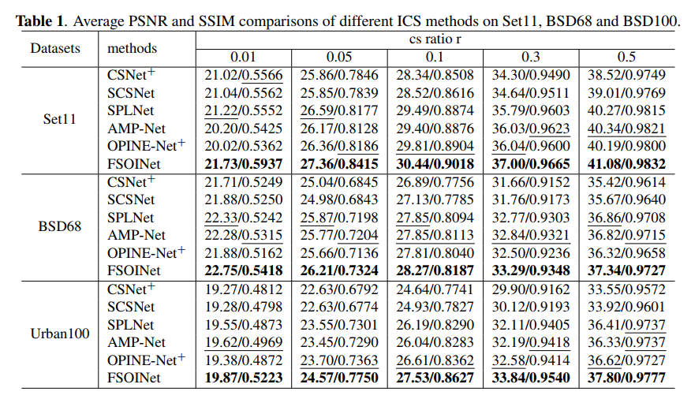
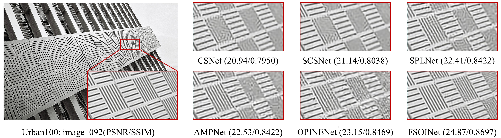

# FSOINET: Feature-Space Optimization-Inspired Network for Image Compressive Sensing [PyTorch]

This repository provides a implementation of the model proposed  in the following paper

FSOINET: Feature-Space Optimization-Inspired Network for Image Compressive Sensing which is accepted by 2022 IEEE International Conference on Acoustics, Speech and Signal Processing(icassp 2022)

## Datasets
For training,  we use 400 images from the training set and test set of the BSDS500 dataset. The training images are cropped to 89600 96*96 pixel sub-images with data augmentation. For testing, we utilize three widely-used benchmark datasets, including Set11, BSDS68 and Urban100.
Users can download the pre-processed training set from [GoogleDrive](https://drive.google.com/file/d/1hELlT70R56KIM0VFMAylmRZ5n2IuOxiz/view?usp=sharing). Training sets and test sets need to be placed under **./DataSets/**.

## Test
1. All models for our paper have been put in './save_temp'.
2. Run the following scripts to test FSOINET model.
    ```bash
    # test scripts
    python test.py  --sensing-rate 0.1 --test_name Set11
    ```
3. You can change the sensing-rate and test_name to to get test results for different sensing rates in different datasets.

## Train
1. Run the following scripts to train FSOINET model.
 ```bash
    # train scripts
    python train.py --sensing_rate 0.1 --layer_num 16 --learning_rate 2e-4 --start_epoch 0 --epochs 100 --batch_size 32
 ```
2. You can change the sensing_rate to train models for different sensing rates.

## Results

### Quantitative Results



### Visual Results



## Citation
If you find the code helpful in your research or work, please cite our papers.

